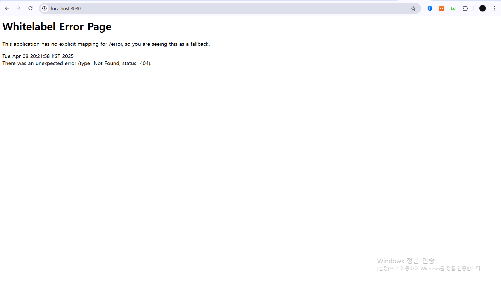

2025-1 backend study  
1주차 주제  
웹과 HTTP  
프론트엔드와 백엔드  
REST API  

웹: 여러 컴퓨터가 서로 연결되어 정보를 공유하는 공간  
-형태: 클라이언트 - 서버 패러다임  
-클라이언트: 데이터의 생성/조회/수정/삭제 요청 전송  
-서버 : 클라이언트의 요청 수행, 응답 전송  

프로토콜: 네트워크 안에서 요청과 응답을 보내는 규칙 (웹 : HTTP프로토콜)  
HTTP Method : 데이터를 다루는 방법(동사)  
URL(Uniform Resource Location) : 다룰 데이터의 위치 (목적어)  

HTTP Method  
Get : 데이터 조회  
Post : 데이터 생성  
Put : 데이터 교체  
Patch : 데이터 부분 수정  
Delete : 데이터 삭제  

url 구조 : 프로토콜 + 서버 주소 + 서버 내 데이터 위치  
                                ㄴ/user/1/nickname  
path parameter  
                                ㄴ/user/{user_id}/nickname  
query string  
                                ㄴ?page=1&keyword=hello  

HTTP 데이터 = HTTP 헤더 + HTTP 바디  
헤더 : 통신에 대한 정보 (언제, 누가 , method 종류, 요청 경로)  
바디 : 주고 받으려는 데이터(json 형식)  

응답 : 상태코드 포함  
200 OK  
201 Created  
400 bad request  
404 not found  
500 internal server error  

자주 변하지 않는 화면 UI : 프론트엔드  
자주 변하는 컨텐츠 : 백엔드  

프론트 -> 백 : 컨텐츠 데이터 요청  
백 -> 프론트 : 데이터 응답  

API(Application Programming Interface)  
어플리케이션과 소통하는 방법을 정의한 것  
ㄴ어떤 method, url을 사용해야하는지   
ㄴ어떤 응답을 보내는지   

REST API : REST 아키텍처를 따르도록 설계한 API  
URL : 조작할 데이터 (명사)  
HTTP Method : 데이터에 대한 행위 (동사)  

세부 기능 API  

유저 회원 가입 / 로그인  
Post /members  
Post /login  

나의 할 일 생성 / 조회 / 수정 / 삭제  
post /todo  
get /todo/list  
patch /todo/{todo_id}  
delete /todo/{todo_id}  

나의 할 일 체크 / 체크 해제  
post /todo/{todo_id}/check  
post /todo/{todo_id}/uncheck  

친구 찾기 / 팔로우 / 언팔로우 / 나의 친구 리스트 조회  
get /users?name=이성혁  
post /users/{users_id}/follow  
delete /users/{users_id}/follow  
get /users/follow  

특정 친구의 할 일 조회  
get /users/{user_id}/todos  

